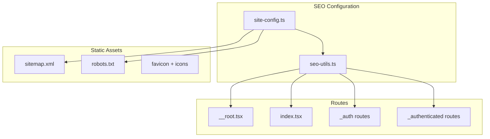

# Setup Metadata dan SEO Terbaik untuk Habitutor

## Arsitektur SEO



## File yang Akan Dibuat/Dimodifikasi

### 1. Konfigurasi SEO Terpusat

**Buat** [`apps/web/src/lib/seo-config.ts`](apps/web/src/lib/seo-config.ts):

- Site metadata (nama, deskripsi, URL, keywords)
- Default Open Graph dan Twitter Card config
- JSON-LD organization schema

**Buat** [`apps/web/src/lib/seo-utils.ts`](apps/web/src/lib/seo-utils.ts):

- Helper `createMeta()` untuk generate meta tags
- Helper `createJsonLd()` untuk structured data
- Type-safe interface untuk SEO props

### 2. Update Root Layout

**Modifikasi** [`apps/web/src/routes/__root.tsx`](apps/web/src/routes/__root.tsx):

- Tambah default meta description
- Tambah Open Graph tags (og:site_name, og:type, og:locale)
- Tambah Twitter Card tags
- Tambah canonical URL
- Tambah favicon dan apple-touch-icon links
- Tambah JSON-LD Organization schema

### 3. Per-Route Meta Tags

**Modifikasi** halaman publik dengan head() function:

| Route | Title | Description |

|-------|-------|-------------|

| `/` (Home) | Habitutor - Persiapan SNBT Terbaik | Landing page description |

| `/login` | Masuk - Habitutor | Auth page |

| `/register` | Daftar - Habitutor | Registration |

| `/dashboard` | Dashboard - Habitutor | User dashboard |

| `/classes` | Kelas - Habitutor | Classes list |

| `/premium` | Premium - Habitutor | Premium page |

| `/latihan-soal` | Latihan Soal - Habitutor | Practice |

### 4. Static Assets

**Update** [`apps/web/public/robots.txt`](apps/web/public/robots.txt):

```
User-agent: *
Allow: /
Disallow: /dashboard
Disallow: /premium/payment
Sitemap: https://habitutor.id/sitemap.xml
```

**Buat** [`apps/web/public/sitemap.xml`](apps/web/public/sitemap.xml):

- Halaman publik: `/`, `/login`, `/register`
- Halaman kelas (jika ada route publik)

**Buat** favicon assets:

- `favicon.ico` (16x16, 32x32)
- `apple-touch-icon.png` (180x180)
- `og-image.png` (1200x630) untuk social sharing

### 5. Structured Data (JSON-LD)

Tambahkan di halaman yang relevan:

- **Organization** schema di root
- **WebSite** schema dengan SearchAction
- **BreadcrumbList** untuk navigasi

## Contoh Implementasi

### seo-config.ts

```typescript
export const siteConfig = {
  name: "Habitutor",
  description: "Platform persiapan SNBT terbaik...",
  url: "https://habitutor.id",
  ogImage: "https://habitutor.id/og-image.png",
  keywords: ["SNBT", "UTBK", "bimbel online", ...],
  creator: "@habitutor",
}
```

### Per-route head()

```typescript
export const Route = createFileRoute("/")({
  head: () => ({
    meta: createMeta({
      title: "Habitutor - Persiapan SNBT Terbaik",
      description: "Ubah persiapan ujian...",
      image: "/og-image.png",
    }),
  }),
  component: HomeComponent,
});
```

## Checklist SEO

- Meta title dan description per halaman
- Open Graph tags untuk Facebook/LinkedIn
- Twitter Card tags
- Canonical URLs
- robots.txt dengan sitemap reference
- sitemap.xml untuk halaman publik
- Favicon dan touch icons
- JSON-LD structured data
- noindex untuk halaman authenticated (opsional)